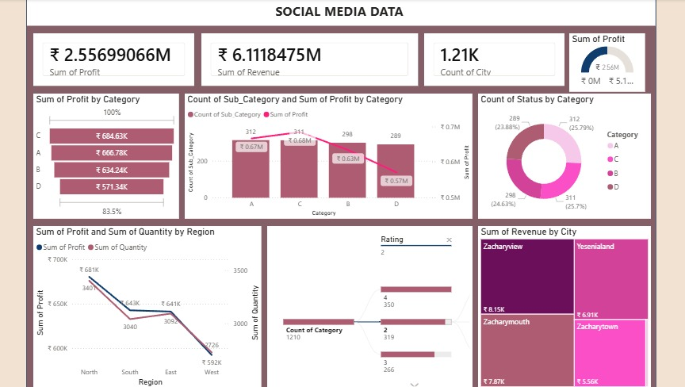

# Social Media Performance Dashboard

## Project Overview
This project is an interactive Power BI dashboard designed to analyze social media performance. It provides insights into profit, revenue, category performance, city-wise revenue, regional trends, and overall business performance through interactive visualizations.

## Dataset
The dataset used in this project includes social media business data such as category, sub-category, revenue, profit, quantity, city, region, ratings, and performance metrics.

## Tools Used
- Microsoft Power BI
- Data Visualization
- Interactive Dashboards
- Filters and Slicers
- Business Analytics

## Dashboard Preview

The dashboard below presents the final Power BI dashboard developed for social media performance analysis.

## Key Insights
- Profit Analysis
- Revenue Analysis
- Category-wise Profit
- Sub-category Performance
- City-wise Revenue
- Region-wise Profit and Quantity
- Rating Analysis
- Business Performance KPIs

## Files
- Social_Media_Performance_Dashboard.pbix
- Social_Media_Performance_Dashboard.jpeg

## License
This project was developed for educational and portfolio purposes.
